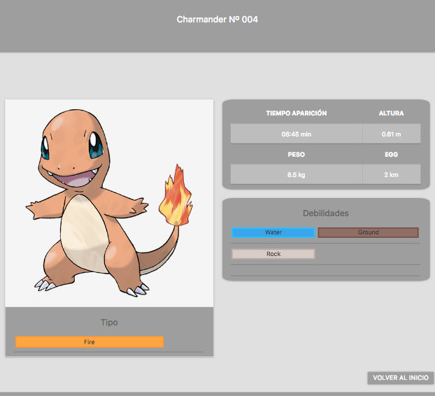
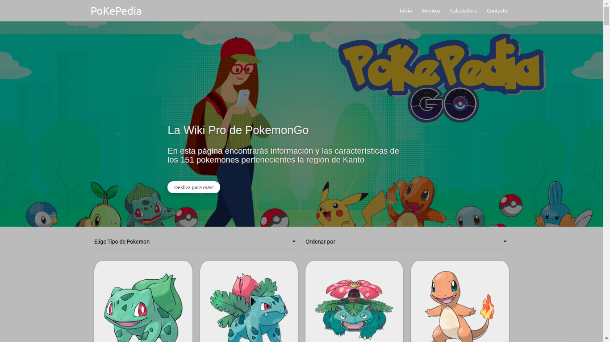
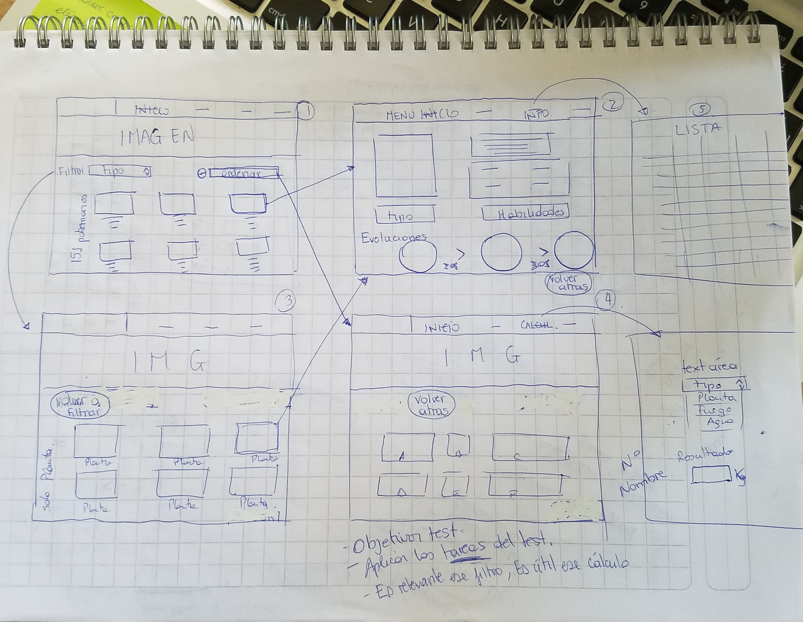
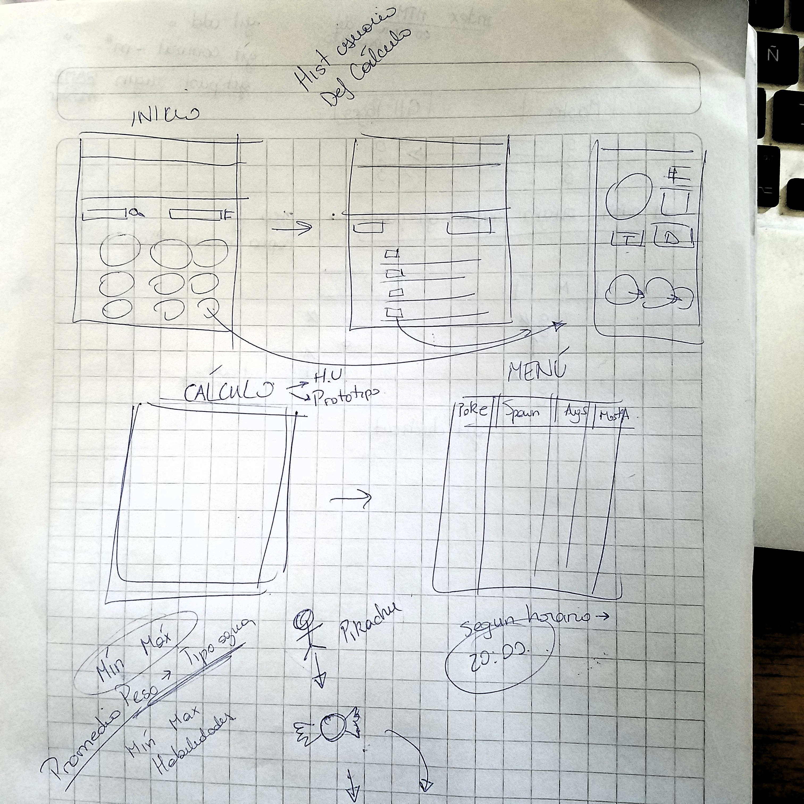
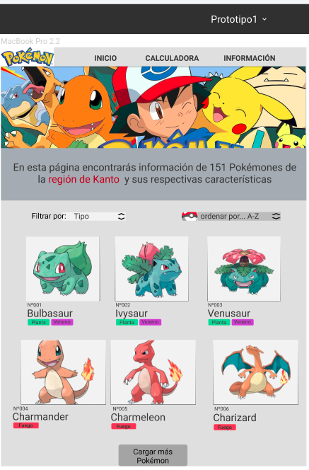
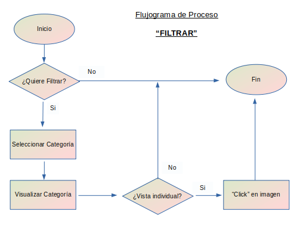
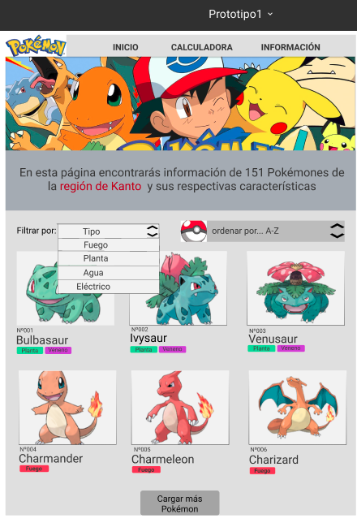
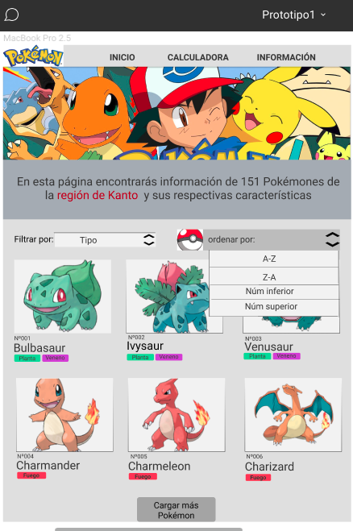

# PokepediaGo

# PROLOGO:

El objetivo principal de este proyecto es realizar una herramienta que le permita a los Pokemon Trainer visualizar la información requerida de diversos pokemones de manera que pueda acceder a ella de forma fácil y precisa. Para ello se tienen en consideración los siguientes objetivos:

• Ubicar y visualizar en primera instancia de forma fácil y sencilla utilizando la imagen de cada criatura, el nombre y/o número de identificación.

• Cuando el usuario encuentre el pokemon de su interés al hacer Click"  en la imagen podrá ver la información detallada basándose en sus debilidades, tipo, peso, evolución entre otras. 

• Se da la opción de filtrar información según el tipo de pokemon y estará categorizada en un menú desplegable para facilitar su accesibilidad.

• El sitio permitirá ordenar por nombre de forma alfabética y numérica(ascendente o descendente).

• Se da la opción al Pokemon Trainer de ingresar la cantidad de “Candys” necesarios para la evolución de su compañero y a través de la calculadora le indicara cuantos Km debe recorrer para alcanzar su objetivo.

• Además se podrá implementar un buscador donde se escriba; bien sea el nombre del pokemon o también su número de identificación y accederá a toda la información de manera individual.

## Desarrollo de contenidos:

- En este apartado se define el contenido del sitio y toda la información relevante acerca del mismo:

1era Vista: Muestra en la parte superior la barra de navegación con sus botones los cuales al estar en modo responsive se convierten en un menú hamburguesa.
- a) Inicio: Representa la pagina principal del proyecto al hacer "Click" en ella regresa al usuario a esta.
- b) Eventos: Permite el acceso a la pagina oficial de eventos de pokemon https://pokemongolive.com/es/events/.
- c) Calculadora: Muestra una pequeña calculadora que permite realizar el calculo de los Km necesarios a recorrer para completar los "Candys" para evolucionar a un pokemon.
- d)Contacto:Muestra información del contacto de los desarrolladores de la pagina web en caso de solicitar alguna información y/o emitir opinión.

Por otro lado, se puede visualizar debajo de la barra de navegación la imagen principal de la pagina alusiva a Pokemon así como también el logo oficial.

Se le integro una breve descripción de lo que el usuario encontrara en la pagina y un botón scroll "Desliza para más!" 

Debajo se encuentran dos select; al lado izquierdo el de filtrar la data el cual permite filtrar la información por el tipo de pokemon y del lado derecho el de ordenar lo cual sirve para ordenar la data de forma alfabética o numérica.

Se presentan como foco principal el conjunto de los 151 pokemones con los datos como número, nombre y tipo. La interacción del usuario le permite notar a través de un hover identificar que al hacer "Click" en la imagen lo lleva a una nueva página.

2da. Vista:
(pokemones filtrados por) : Despliega el conjunto de pokemones según el tipo seleccionado.
(pokemones ordenados por) :
Despliega el conjunto de pokemones según el orden (alfabeto/numérico, ascendente o descendente) seleccionado.
Además incluye un hover que al hacer "Click" redirige a la descripción de cada pokemon.

3era. Vista:
Incluye información específica y detallada de cada pokemon, tal como: nombre y número (en la parte superior), breve descripción de la criatura, un recuadro con el tiempo de aparición, Egg, altura, % aparición, peso, evolución, debilidades y tipo; así como también las imágenes evolucionadas del mismo.

Ninguna de las vistas generan documento de HTML nuevo, solo ocultan la vista anterior y muestra la nueva. 

##### La pantalla principal se ve de la siguiente manera:

## HISTORIA DE USUARIOS Y PROTOTIPOS DE USABILIDAD:

Una vez definido el tema del proyecto se realizo en primera instancia los sketch; a partir del cual se inicia el prototipo de baja fidelidad con Figma (aplicación de diseño de interfaces ), recibiendo feedback tanto del propio squad como de algunas compañeras del Boopcamp, luego fue plasmado en un prototipo de alta fidelidad elaborado en la misma herramienta (Ver imagen en cada historia de usuario) y al cual se le aplico a través de entrevista de usuario algunos cambios.

### - Sketch 1. Pantalla principal

### - Sketch 2. Pantalla Filtrar/ Ordenar

### - Sketch 3. Pantalla Calculo

### - Sketch 1. Pantalla principal

## Caso # 1: (Visualizar información General)

- Nicolás tiene 15 años y acaba de descargar pokemonGO por recomendación de un amigo a quien observo jugando. Él nunca ha visto la serie pokemón, solo conoce a los más populares por lo que ingresa a la pagina para conocerlos mejor.

• Como: Nuevo jugador 
• Quiero: Consultar un catálogo y conocer más a fondo los pokemones.
• Para: Avanzar de nivel y hacerme un jugador experto.

Definición de terminado: 

- Visualizar más de 100 pokemones en forma general con su respectiva imagen, nombre y número.
- Seleccionar la imagen de un pokemon podrá acceder a información más detallada.

### Flujo de interacción:

### Prototipado:

## Caso # 2: (Filtrar información)

- José es un jugador habitual de Pokemon Go. Para el próximo fin de mes él y sus amigos pondrán a prueba sus habilidades en una batalla. José sabe que en los combates no se trata solo de tener el pokemón más fuerte, también debe conocer las características de cada uno y saber como contraatacar. Su contrincante posee algunos pokemones del tipo fuego por lo que desea verlos agrupados en un solo bloque para estudiarlos a fondo.

• Como: Jugador habitual de PokemonGo
• Quiero: Poder filtrar los pokemon por tipo
• Para: Determinar el contraataque a su contrincante

Definición de terminado: 

- Una herramienta que permita filtrar por tipo.
- Filtrar por número.
- Filtrar por nombre.

### Flujo de interacción:

### Prototipado:
#### Seleccionando el tipo

#### Vista resultado de filtar por tipo "Planta".

## Caso # 3 (Ordenar información)

- Sofía es una profesora y esta pensando la manera más divertida de enseñarle a sus alumnos el alfabeto; investigando sobre temas y juegos se encontró que el Trending Topic actualmente es el PokemonGo y ha visto a algunos con cartas de pokemon por lo que le pareció una gran idea utilizarlo en clase. 

• Como: Profesora de 1ro. Básico
• Quiero: Ordenar de forma Alfabética los nombres de pokemon
• Para: Facilitar el aprendizaje de los niños.

Definición de terminado: 

- Que exista un “Select” con sus categorías
- Pueda ordenar los nombres de la A-Z.
- Pueda ordenar los nombres de la Z-A.
- Pueda ordenar los pokemon por número de mayor a menor.
- Pueda ordenar los pokemon por número de menor a mayor.

### Flujo de interacción:

### Prototipado:
#### Seleccionando el orden

#### Vista del resultado de ordenar por "Número inferior"

## Caso # 4: (Cálculos)

- Juana es una chica fitness y últimamente se ha vuelto una aficionada al juego pokemonGo ya que descubrió la forma de entrenar y avanzar en el juego, pero desea conocer cuanto kilómetros necesita recorrer diarios para evolucionar a su pokemon preferido. 

• Como: Deportista fitnes y jugadora de pokemon
• Quiero: Calcular cuantos Km necesito recorrer para conseguir “Candys”
• Para: Fijar los kilometros a caminar y evolucionar a mi pokemon.

Definición de terminado: 

- Que exista una calculadora
- Calcular cuantos kilometros equivalen a un candy
- Calcular cuantos candys equivalen a kilómetros
- Calcular en cuantos kilómetros evoluciona mi pokemon
- Calcular en cuantos candys evoluciona mi pokemon

### Flujo de interacción:

### Prototipado:
#### Calculadora

## Caso # 5: (Búsqueda) (Opcional)

Javier tiene 20 años y es usuario de la aplicación pokemonGO, él quiere seguir aumentando de nivel en el juego y para esto planea asistir a un evento en el Parque Forestal, donde dicen podrá capturar a Pikachu. Javier decide ir preparado a este encuentro y así asegurarse la captura de este pokemon. Por lo que decide reunir toda la información posible acerca de Pikachu.

• Como: Jugador habitual de pokemonGo
• Quiero: Obtener información detallada de determinado pokemon 
• Para: Prepararme para el evento y asegurar la captura del mayor número de Pikachu posible.

Definición de terminado: 

- Que exista un Buscador
- Buscar por nombre
- Buscar por número
