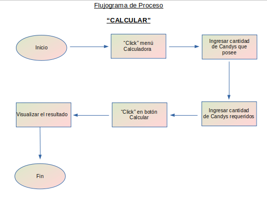

# PROLOGO:

El objetivo principal de este proyecto es realizar una herramienta que le permita a los Pokemon Trainer vizualizar la información requerida de diversos pokemones de manera que pueda acceder a ella de forma fácil y precisa. Para ello se tienen en consideración los siguientes objetivos:

    • Ubicar y visualizar en primera instancia de forma facil y sencilla utilizando la imagen de cada criatura, el nombre y/o número de identificación.

    • Cuando el usuario encuentre el pokemon de su interés al hacer click en la imagen podrá ver la información detallada basandose en sus debilidades, tipo, peso, evolución entre otras. 
    • Se da la opción de filtrar información según el tipo de pokemon y estará categorizada en un menu desplegable para facilitar su accesibilidad.
    • El sitio permitirá ordenar por nombre de forma alfabetica (ascendente o descendente).
    • Se dá la opción al Pokemon Trainer de ingresar la cantidad de “Candys” necesarios para la evolución de su compañero y a tráves de la calculadora le indicara cuantos Km debe recorrer para alcanzar su objetivo.
    • Además se podrá implementar un buscador donde se escriba; bien sea el nombre del pokemon o tambien su número de identificación y accedera a toda la información de manera individual.

# HISTORIA DE USUARIOS:

## Caso # 1: (Visualizar infomación General)

- Nicolás tiene 15 años y acaba de descargar pokemonGO por recomendación de un amigo a quien observo jugando. Él nunca ha visto la serie pokemón, solo conoce a los más populares por lo que ingresa a la pagina para conocerlos mejor.

    • Como: Nuevo jugador 
    • Quiero: Consultar un catálogo y conocer más a fondo los pokemones.
    • Para: Avanzar de nivel y hacerme un jugador experto.

Definición de terminado: 

-  Visualizar más de 100 pokemones en forma general con su respectiva imagen, nombre y número.
- Seleccionar la imagen de un pokemon podrá acceder a información más detallada.

### Flujo de interacción:

## Caso # 2: (Filtrar información)

- José es un jugador habitual de Pokemon Go. Para el próximo fin de mes él y sus amigos pondrán a prueba sus habilidades en una batalla. José sabe que en los combates no se trata solo de tener el pokemón más fuerte, también debe conocer las características de cada uno y saber como contraatacar. Su contrincante posee algunos pokemones del tipo fuego por lo que desea verlos agrupados en un solo bloque para estudiarlos a fondo.

    • Como: Jugador habitual de PokemonGo
    • Quiero: Poder filtrar los pokemon por tipo
    • Para: Determinar el contraataque a su contrincante

Definición de terminado: 

- Una herramienta que permita filtrar por tipo.
- Filtrar por número.
- Filtrar por nombre.

### Flujo de interacción:

## Caso # 3 (Ordenar información)

- Sofia es una profesora y esta pensando la manera más divertida de enseñarle a sus alumnos el alfabeto; investigando sobre temas y juegos se encontró que el Trending Topic actualmente es el PokemonGo y ha visto a algunos con cartas de pokemon por lo que le pareció una gran idea utilizarlo en clase. 

    • Como: Profesora de 1ro. Básico
    • Quiero: Ordenar de forma Alfabetica los nombres de pokemon
    • Para: Facilitar el aprendizaje de los niños.

Definición de terminado: 

-  Que exista un “Select” con sus categorias
-  Pueda ordenar los nombres de la A-Z.
-  Pueda ordenar los nombres de la Z-A.
-  Pueda ordenar los pokemon por número de mayor a menor.
-  Pueda ordenar los pokemon por número de menor a mayor.

### Flujo de interacción:

## Caso # 4: (Cálculos)

- Juana es una chica fitness y últimamente se ha vuelto una aficionada al juego pokemonGo ya que descubrió la forma de entrenar y avanzar en el juego, pero desea conocer cuanto kilómetros necesita recorrer diarios para evolucionar a su pokemon preferido. 

    • Como: Deportista Fitnes y jugadora de pokemon
    • Quiero: Calcular cuantos Km necesito recorrer para conseguir “Candys”
    • Para: Fijar los kilometros a caminar y evolucionar a mi pokemon.

Definición de terminado: 

- Que exista una calculadora
- Calcular cuantos kilometros equivalen a un candy
- Calcular cuantos candys equivalen a kilometros
- Calcular en cuantos kilometros evoluciona mi pokemon
- Calcular en cuantos candys evoluciona mi pokemon

### Flujo de interacción:

## Caso # 5: (Busqueda) (Opcional)

Javier tiene 20 años y es usuario de la aplicación pokemonGO, él quiere seguir aumentando de nivel en el juego y para esto planea asistir a un evento en el Parque Forestal, donde dicen podrá capturar a Pikachu. Javier decide ir preparado a este encuentro y así asegurarse la captura de este pokemon. Por lo que decide reunir toda la información posible acerca de Pikachu.

    • Como: Jugador habitual de pokemonGo
    • Quiero: Obtener información detallada de determinado pokemon 
    • Para: Preparame para el evento y asegurar la captura del mayor número de Pikachu posible.

Definición de terminado: 

- Que exista un Buscador
- Buscar por nombre
- Buscar por número